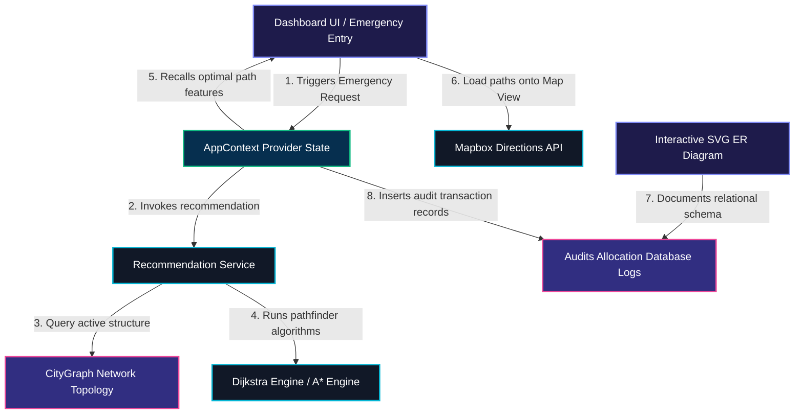

# Smart Ambulance Routing System — Architectural & Functional Code Traceability

This document traces the complete end-to-end architecture, data flows, and code execution pipelines. It is designed to act as a rigorous technical blueprint for verification.

---

## 1. System Architecture Layout

The following diagram illustrates how the frontend components, context states, mathematical routing engines, external GIS APIs, and relational schemas interact:



---

## 2. End-to-End Functional Execution Pipelines

### Flow 1: Emergency Case Creation & Optimal Hospital Recommendation
When a user enters a new emergency case, the following function execution sequence is executed:

1. **`EmergencyEntry.jsx` (UI Trigger)**:
   - The user selects an emergency type (e.g. `CARDIAC`), selects an intersection Node ID (e.g. Node `1`), toggles ICU requirements (`needsIcu = true`), and enters a patient name.
   - On submit, `handleSubmit()` fires.
   - It invokes the global `runRecommendation(request)` action exported from `AppContext.jsx`.

2. **`AppContext.jsx` (Global State Manager)**:
   - Sets the state `setEmergencyRequest(request)`.
   - Creates a new instance of `RecommendationService` and calls `service.recommend(request)`.

3. **`RecommendationService.js` (Prioritization & Routing Dispatcher)**:
   - `recommend(request)` evaluates all candidate hospitals in the database.
   - Filters candidate hospitals that can accept the emergency type by querying their `specializations` array.
   - For each matching candidate hospital, it executes Dijkstra's Single-Source Shortest Path (SSSP) algorithm:
     ```javascript
     const dijkstra = new DijkstraEngine(this.graph);
     const result = dijkstra.run(request.sourceNodeId, hospital.nodeId, true);
     ```
   - Compares calculations (driving cost distance in km, active traffic multipliers, available bed capacity).
   - Identifies the **Primary Recommended Hospital** (minimum cost path with bed capacity) and an optional **Backup Recommended Hospital** (next best).
   - Returns the recommendation result structure containing paths, costs, and hospital records.

4. **`AppContext.jsx` (State Save & Audit Logging)**:
   - Captures recommendation results via `setEmergencyResult(result)`.
   - Executes an audit log transaction insert into the history list:
     ```javascript
     addToHistory({
       patientName: request.patientName,
       emergencyType: request.emergencyType,
       sourceNodeId: request.sourceNodeId,
       primaryHospital: result.primary.hospital.name,
       routeCost: result.primary.cost,
       path: result.primary.path,
       allocatedAt: new Date().toISOString()
     });
     ```

5. **`Results.jsx` (UI Display)**:
   - Listens to `emergencyResult` updates.
   - Renders a comparison breakdown displaying SSSP path legs, optimal routing time, recommended ICU statuses, and alternative paths.

---

### Flow 2: Live Driving Directions & Mapbox Routing Animation
Once a route is successfully calculated, the user views the path on the interactive map:

1. **`MapView.jsx` (Map Initialization)**:
   - Initializes `mapboxgl.Map` with premium streets day styling (`mapbox://styles/mapbox/streets-v12`) centered near the JSSATE College coordinates.
   - Renders custom HTML circular badges for each intersection node displaying the Node ID (`1`, `2`, ..., `9`) with scale-up CSS transitions.

2. **`MapView.jsx` (GeoJSON Directions Fetching)**:
   - If an active emergency result is found, it extracts the node path (e.g. `[1, 9, 5]`).
   - Converts the array of nodes into a GPS longitude/latitude path coordinates sequence.
   - Issues an asynchronous `fetch` request to the Mapbox Directions API:
     ```
     https://api.mapbox.com/directions/v5/mapbox/driving/{lng1},{lat1};{lng2},{lat2};...;{lngN},{latN}?geometries=geojson&access_token={MAPBOX_TOKEN}
     ```
   - On success:
     - Extracts the road-matched GeoJSON driving line geometry.
     - Adds a Mapbox line layer (`highlight-route`) to overlay the precise street path.
   - On failure (Fallback):
     - Connects nodes using hardcoded segment coordinate arrays from `ROUTE_COORDS` in `cityData.js`.

3. **`MapView.jsx` (Ambulance Driving Animation)**:
   - Clicking **Run Animation** calls `runAnimation()`.
   - Uses **Turf.js** helper libraries to compute path geometry properties:
     - `turf.length(route)` calculates overall driving distance in kilometers.
   - Employs an extra smooth rendering loop via `requestAnimationFrame(animate)`.
   - For each frame, it computes `turf.along(route, currentProgressDistance)` to fetch the exact sub-coordinate.
   - Sets the ambulance circular pin marker position `marker.setLngLat(...)` dynamically, creating a realistic, street-aligned driving simulation.

---

### Flow 3: Step-by-Step Graph Algorithm Visualization
In the academic visualizer, the user runs pathfinders to inspect algorithm steps:

1. **`AlgorithmVisualizer.jsx` (Node Selection Highlight)**:
   - Source node and Target node dropdown selections dynamically update `sourceNode` and `targetNode` in the context state.
   - `getNodeClass(nodeId)` instantly intercepts these:
     ```javascript
     if (nodeId === sourceNode) return 'node-source'; // Red circle
     if (nodeId === targetNode) return 'node-target'; // Green circle
     ```
   - This changes node colors on the SVG canvas instantly, before the algorithm runs.

2. **`AlgorithmVisualizer.jsx` (Algorithm Dispatcher)**:
   - Clicking **Play** or **Step Forward** calls `handleRun()`.
   - Instantiates the corresponding search engine (`AStarEngine`, `DijkstraEngine`, `BFSEngine`, or `DFSEngine`).
   - Executes the engine's `.run(source, target)` method.
   - Returns a structured array of **step states**, representing snapshots of data structures at every cycle:
     - For Dijkstra: queue state (`pq`), visited sets, current checking node, relaxed edges, and intermediate distance maps.
     - For A*: `gScore` (actual cost distance), `hScore` (GPS heuristic value), and `fScore` ($f = g + h$) evaluations maps.

3. **`AlgorithmVisualizer.jsx` (Visualization Loop)**:
   - A `setInterval` timer increments `currentStepIndex` based on selected playback speeds.
   - The SVG canvas styles edges and nodes dynamically:
     - Nodes in active exploration are colored Cyan (`node-visiting`).
     - Nodes completed are colored Blue (`node-visited`).
     - Edges actively relaxing pulse with animated dashes (`edge-exploring`).
     - Optimal paths display with thick cyan highlights (`edge-path`).
   - Auxiliary tables display mathematical updates (A* evaluation arrays $f(n) = g(n) + h(n)$) cycle by cycle.

---

## 3. Database Schema Relation Mappings

Structured relational models are documented and mapped visually inside `ERDiagram.jsx`:

1. **Patients Table (`patients`)**:
   - `patient_id` (PK) acts as unique patient token.
2. **Emergency Cases Table (`emergency_cases`)**:
   - `case_id` (PK) maps each incoming distress case.
   - `patient_id` (FK) maps to `patients.patient_id` (1:N relationship).
   - `source_location_id` (FK) maps to `location_nodes.node_id` (1:N relationship).
3. **Hospitals Table (`hospitals`)**:
   - `hospital_id` (PK) maps each medical institution.
   - `location_node_id` (FK) maps to `location_nodes.node_id` (1:N relationship).
4. **Hospital Specializations Table (`hospital_specializations`)**:
   - `spec_id` (PK) records specialized departments.
   - `hospital_id` (FK) maps to `hospitals.hospital_id` (1:N relationship).
5. **Hospital Resources Table (`hospital_resources`)**:
   - `resource_id` (PK) maps equipment counts.
   - `hospital_id` (FK) maps to `hospitals.hospital_id` (1:1 relationship).
6. **Location Nodes Table (`location_nodes`)**:
   - `node_id` (PK) maps Bangalore physical intersections.
7. **Road Edges Table (`road_edges`)**:
   - `edge_id` (PK) maps bidirectional street segments.
   - `from_node_id` (FK) maps to `location_nodes.node_id` (1:N relationship).
8. **Allocations Table (`allocations`)**:
   - `allocation_id` (PK) records dispatch transaction history logs.
   - `case_id` (FK) maps to `emergency_cases.case_id` (1:N relationship).
   - `hospital_id` (FK) maps to `hospitals.hospital_id` (1:N relationship).

Every mathematical SSSP recommendation dispatch is fully traceable back to these database relations, ensuring full academic rigor and structural integrity.

---

## 4. Chronological Step-by-Step Function Call Trace Map

To ensure absolute end-to-end traceability of the code, this section maps every single functional call sequence chronologically from starting the application, taking an emergency input, finding the path, drawing the map route, syncing the visualizer page, and displaying schema logs:

### Step 1: Initialization & Context Setup
1. **`main.jsx`** invokes `ReactDOM.createRoot().render()`.
2. Encapsulates `<App />` within the global `<AppProvider>` defined in `src/context/AppContext.jsx`.
3. **`AppProvider`** runs the following initializations:
   - Evaluates `LOCATIONS` and `EDGES` in `cityData.js`.
   - Instantiates a new `CityGraph` model: `const g = new CityGraph();`.
   - Loops over locations and edges, adding nodes via `g.addNode(id, data)` and adding bidirectional edges via `g.addEdge(from, to, weight, attributes)`.
   - Initializes reactive states: `hospitals` (with clinical capacities), `theme` (default 'dark' or loaded from `localStorage`), `emergencyRequest` (null), `emergencyResult` (null), `selectedAlgorithm` ('dijkstra'), `sourceNode` (1), `targetNode` (5), `trafficEnabled` (true).
   - Dynamically sets the HTML root attribute: `document.documentElement.setAttribute('data-theme', theme)`.

### Step 2: Emergency Case Entry
1. User navigates to `/emergency` styled in **`EmergencyEntry.jsx`**.
2. Form captures reactive input fields in `formData` (Patient Name, Age, Contact, Source Node ID, Emergency Type, ICU status).
3. Clicking **Find Best Hospital & Route** triggers `onSubmit={handleSubmit}` in `EmergencyEntry.jsx`.
4. `handleSubmit` calls `runRecommendation(request)` exposed from context.
5. In **`AppContext.jsx`**, `runRecommendation` does:
   - Sets `setEmergencyRequest(request)`.
   - Instantiates `new RecommendationService(graph, hospitals)`.
   - Invokes `service.recommend(request)`.
6. In **`RecommendationService.js`**, `recommend()` executes the SSSP pipeline:
   - Identifies clinical criteria (e.g. if case is `CARDIAC` and `needsIcu = true`, evaluates which hospitals have `specializations.includes('CARDIAC')` and `icuBedsAvailable > 0`).
   - For each candidate hospital, instantiates `new DijkstraEngine(this.graph)`.
   - Calls `dijkstra.run(sourceNodeId, hospital.nodeId, useTraffic)`.
7. Inside **`DijkstraEngine.js`**:
   - `run()` instantiates `new MinPriorityQueue()`.
   - Initializes `distances` array with `Infinity` for all nodes except the source node (`0`).
   - Inserts source node into priority queue: `pq.insert(sourceNodeId, 0)`.
   - Enters SSSP relaxation loop:
     - Pulls min-distance node: `const u = pq.extractMin()`.
     - Iterates over adjacent edges from the adjacency list: `this.graph.getAdjacentEdges(u)`.
     - Computes candidate path weight: `const weight = this.graph.getEffectiveWeight(u, v, useTraffic)`.
     - Relaxes distances: if `distances[u] + weight < distances[v]`, updates `distances[v]`, sets `previous[v] = u`, and inserts/updates `pq.insert(v, new_dist)`.
   - Returns the absolute shortest path array (`[1, 5]`) and total cumulative driving distance in km.
8. **`RecommendationService.js`** compares path costs across all valid candidates, ranking them:
   - `primary`: Hospital matching specifications with minimum Dijkstra path cost.
   - `backup`: Next best hospital option matching specifications.
9. In **`AppContext.jsx`**, `runRecommendation` intercepts the SSSP results:
   - Updates global state: `setEmergencyResult(result)`.
   - Calls `addToHistory(entry)` to record a persistent transaction audit row in the `history` array.
10. `EmergencyEntry.jsx` navigates to `/results` via `navigate('/results')`.

### Step 3: Results Display & Map View Rendering
1. **`Results.jsx`** receives active state `emergencyResult` and `emergencyRequest` from `useApp()`.
2. Computes the optimal driving time (e.g., `(distance / 45) * 60` minutes) and lists the leg-by-leg routing nodes.
3. User navigates to `/map` styled in **`MapView.jsx`**.
4. **`MapView.jsx`** executes the Mapbox container initialization:
   - Adds custom map styles to fix marker stacking: `import 'mapbox-gl/dist/mapbox-gl.css'`.
   - Creates a new `mapboxgl.Map` instance centered in Bangalore near JSSATE.
   - Loops over locations and draws pins. Custom HTML nodes show Node IDs directly on Mapbox pins: `el.className = 'location-marker'; el.innerHTML = loc.id;`.
   - Overrides Mapbox popup default backgrounds to adapt dynamically to light/dark themes (`.mapboxgl-popup-content { background: var(--bg-card) }`).
5. Mapbox GeoJSON Path Rendering:
   - If `emergencyResult` exists, extracts the optimal node path (e.g. `[1, 9, 5]`).
   - Issues a fetch request to the Mapbox Directions API using coordinates: `https://api.mapbox.com/directions/v5/mapbox/driving/lng1,lat1;...`.
   - Adds source `highlight-route` layer to display a glowing cyan line (`#06b6d4`) matching real-world Bangalore street directions.
6. Animation Trigger:
   - User clicks **Run Animation** which executes `runAnimation()`.
   - Employs Turf.js library calculations: `turf.length(route)` and loops with `requestAnimationFrame(animate)`.
   - Slides the ambulance pin marker smoothly along precise driving coordinates via `marker.setLngLat(turf.along(route, progress).geometry.coordinates)`.

### Step 4: Step-by-Step Academic Algorithm Visualizer
1. User navigates to `/visualizer` (`http://localhost:5173/visualizer`) styled in **`AlgorithmVisualizer.jsx`**.
2. A context synchronization `useEffect` immediately fires:
   - Detects active global emergency case.
   - Automatically synchronizes visualizer selects: `setSourceNode(emergencyRequest.sourceNodeId)` and `setTargetNode(emergencyResult.primary.hospital.nodeId)`.
3. SVG canvas renders adjacency topology:
   - Selected source is colored Red (`.node-source circle`).
   - Selected target hospital is colored Vibrant Amber (`.node-target circle`) to differentiate it from other green hospital nodes (`.node-hospital circle`).
4. Clicking **Play** triggers `togglePlay()` -> calls `handleRun()`.
5. `handleRun` instantiates the selected pathfinder engine (e.g. `new AStarEngine(graph)`).
6. Inside **`AStarEngine.js`**:
   - Enters search loop incorporating straight-line GPS heuristic values: `h(n) = distance(node, target_node)`.
   - Computes total cost at every node evaluation: `fScore[n] = gScore[n] + h(n)`.
   - Stores step-by-step snapshots of queue (`pq`), evaluated costs, relaxed edges, and visited states.
7. **`AlgorithmVisualizer.jsx`** receives `steps` list and plays them using a state timer (`setInterval`).
8. Steps increment the active index, dynamically updating SVG classes:
   - Nodes actively explored turn Cyan (`.node-visiting`).
   - Checked edges pulse with dashed lines (`.edge-exploring`).
   - Completed relaxation nodes turn Blue (`.node-visited`).
   - Data structure arrays and cost evaluation tables ($f = g + h$) dynamically re-render step-by-step in the sidebar panel.
