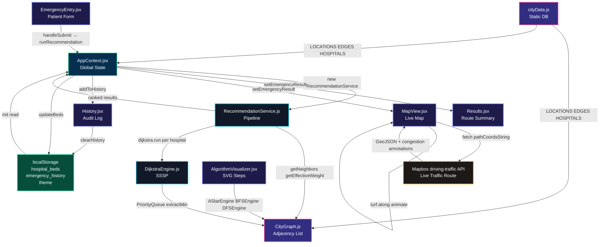

# 🚑 Smart Ambulance Routing & Hospital Allocation System

> **VTU 4th Semester CSE Mini-Project** — Mapping four core CS subjects onto a real emergency-response system built for South Bangalore (centered on JSSATE, Uttarahalli).

---

## 🎓 Academic Syllabus Mappings

| Badge | Subject | How This Project Demonstrates It |
|:------|:--------|:---------------------------------|
| **`BCS401` ADA** | Analysis & Design of Algorithms | Dijkstra SSSP O((V+E)logV), A* with GPS heuristic, binary min-heap priority queue, BFS/DFS traversal with step-by-step tracing |
| **`BCS405B` GT** | Graph Theory & Applications | Weighted undirected graph G=(V,E), adjacency-list representation, reachability, degree analysis, shortest-path proofs |
| **`BCS403` DBMS** | Database Management Systems | Relational schema (8 tables, 3NF), ER diagram with PK/FK annotations, persistent audit log via `localStorage`, bed-count transactions |
| **`BCS402` OOCJ** | Object Oriented Concepts with Java | Class encapsulation (`CityGraph`, `DijkstraEngine`, `RecommendationService`), single-responsibility, dependency injection via React context |

---

## ✨ Complete Feature List

### 🧮 Algorithm Engines (`BCS401 / BCS405B`)
- **Dijkstra's SSSP** — weighted shortest path considering real road distances + traffic multipliers
- **A\* Search** — GPS Haversine heuristic `h(n)` for faster convergence; `f(n) = g(n) + h(n)`
- **BFS** — level-by-level queue traversal with full step capture
- **DFS** — recursive stack-based traversal with backtracking visualization
- **Binary Min-Heap Priority Queue** — pure JS implementation backing Dijkstra and A*

### 🗺️ Live Map & GIS (`BCS405B`)
- **Mapbox GL JS** with `streets-v12` style — real OSM base map
- **Mapbox Directions `driving-traffic` API** — live real-time traffic routing (not just static roads)
- **Per-segment congestion coloring** — route line color-coded green/amber/red per Mapbox traffic annotation
- **Ambulance animation** — smooth 60fps Turf.js path animation with directional heading (emoji rotates to face direction of travel, bearing offset corrected by -90°)
- **Distance badges** — km labels floating at mid-point of every edge on the map
- **13 real GPS nodes** — verified coordinates of Bangalore landmarks
- **6 hospitals** — real addresses, contacts, specializations
- **Route congestion legend** — appears on map bottom-left when route is active
- **Live stats bar** — Mapbox distance, live ETA, dominant congestion, last updated time
- **Refresh Route** button — re-fetches route with current traffic conditions

### 🏥 Emergency Routing System (`BCS401`)
- Patient intake form: name, age, contact, blood group, source node, emergency type, ICU requirement
- 6 emergency types: CARDIAC, TRAUMA, NEURO, BURNS, MATERNITY, GENERAL
- Multi-step hospital filtering: Specialization → Bed Availability → Dijkstra SSSP
- Primary + Backup hospital recommendation
- Algorithm filtering steps displayed on Results page

### 📊 Algorithm Visualizer (`BCS401 / BCS405B`)
- SVG graph canvas with all 13 nodes and 23 edges
- Step-by-step playback with configurable speed (0.5× to 3×)
- Node coloring: source (red), target (amber), visiting (cyan), visited (blue), hospital (green)
- Edge animation: dashed pulsing for edges being explored
- Sidebar: distance table, priority queue state, A* gScore/fScore/hScore breakdown

### 🗃️ Persistent Data (`BCS403`)
- **Emergency history** — stored in `localStorage['emergency_history']`, survives page refresh
- **Hospital bed counts** — stored in `localStorage['hospital_beds']`, edits persist
- **Clear History** button on History page
- **Theme preference** — stored in `localStorage['theme']`

### 📐 ER Diagram (`BCS403`)
- Interactive SVG with 8 database entities
- Hover-activated Bezier relationship connectors with PK→FK annotations
- Relationship cardinality: 1:N, 1:1 displayed on lines

---

## 🗺️ City Graph — 13 Nodes, 6 Hospitals

### Nodes

| ID | Location | Area | Coordinates |
|----|----------|------|-------------|
| 1 | JSSATE College Campus (main road junction) | Uttarahalli | 12.9060, 77.5028 |
| 2 | JP Nagar 6th Phase | JP Nagar | 12.9060, 77.5815 |
| 3 | Kumaraswamy Layout (DSI) | Kumaraswamy Layout | 12.8950, 77.5550 |
| 4 | Sagar Hospitals (DSI) 🏥 | Kumaraswamy Layout | 12.9085, 77.5660 |
| 5 | BGS Gleneagles Hospital 🏥 | Sunkalpalya | 12.8985, 77.4984 |
| 6 | Astra Specialty Hospital 🏥 | Konanakunte Cross | 12.8945, 77.5615 |
| 7 | Padmanabhanagar Circle | Padmanabhanagar | 12.9180, 77.5480 |
| 8 | RRMCH Mysore Road 🏥 | Mysore Road | 12.8963, 77.4619 |
| 9 | Kengeri Bus Terminal | Kengeri | 12.9115, 77.4810 |
| 10 | Banashankari Temple (BSK) | Banashankari | 12.9150, 77.5730 |
| 11 | Apollo Hospital Bannerghatta 🏥 | JP Nagar | 12.8963, 77.5985 |
| 12 | JP Nagar Metro Station | JP Nagar | 12.9073, 77.5731 |
| 13 | Fortis Hospital Bannerghatta 🏥 | JP Nagar | 12.8948, 77.5988 |

### Hospitals (6 total)

| ID | Hospital | Node | Specializations | ICU | General |
|----|----------|------|----------------|-----|---------|
| H1 | RRMCH Mysore Road | 8 | GENERAL, TRAUMA, MATERNITY | 1/5 | 5/12 |
| H2 | Sagar Hospitals DSI | 4 | TRAUMA, BURNS | 3/8 | 8/15 |
| H3 | BGS Gleneagles Global | 5 | CARDIAC, GENERAL, MATERNITY | 2/10 | 4/20 |
| H4 | Astra Super Speciality | 6 | NEURO, GENERAL | 4/6 | 6/10 |
| H5 | Apollo Hospital Bannerghatta | 11 | CARDIAC, NEURO, BURNS | 5/12 | 11/25 |
| H6 | Fortis Hospital Bannerghatta | 13 | CARDIAC, TRAUMA, NEURO | 4/10 | 9/22 |

### Road Edges (23 total)

| Edge | From→To | Distance | Road Name | Traffic Multiplier |
|------|---------|----------|-----------|-------------------|
| e1 | 1→3 | 6.2 km | Uttarahalli-Kumaraswamy Rd | 1.0 |
| e2 | 1→5 | 1.2 km | Dr. Vishnuvardhan Road | 1.0 |
| e3 | 1→6 | 5.8 km | Kanakapura Main Road | 1.5 |
| e4 | 1→8 | 7.2 km | Uttarahalli-RR Nagar Rd | 1.2 |
| e5 | 1→9 | 3.8 km | Kengeri-Uttarahalli Main Rd | 1.0 |
| e6 | 3→7 | 2.8 km | KS Layout Inner Ring | 1.3 |
| e7 | 3→4 | 1.5 km | 26th Main Road | 1.5 |
| e8 | 3→2 | 3.2 km | Bannerghatta Road Link | 2.0 |
| e9 | 7→4 | 1.8 km | Padmanabhanagar-Jayanagar Rd | 1.2 |
| e10 | 7→2 | 4.2 km | JP Nagar Link Road | 1.5 |
| e11 | 4→6 | 3.5 km | Jayanagar-Banashankari Rd | 1.8 |
| e13 | 8→9 | 4.8 km | Kengeri-RR Nagar Highway | 1.0 |
| e14 | 5→9 | 2.9 km | Uttarahalli-Kengeri Ring Rd | 1.2 |
| e15 | 10→6 | 2.2 km | Outer Ring Road (BSK) | 1.5 |
| e16 | 10→2 | 2.5 km | Kanakapura-JP Nagar Rd | 1.2 |
| e17 | 10→7 | 3.0 km | BSK 2nd Stage Ring Rd | 1.3 |
| e18 | 11→2 | 2.0 km | Bannerghatta Main Road | 1.8 |
| e19 | 11→3 | 4.5 km | Arekere-KS Layout Link | 1.4 |
| e20 | 12→2 | 1.2 km | Kanakapura-JP Nagar Link | 1.4 |
| e21 | 12→10 | 1.8 km | Sarakki Signal Road | 1.6 |
| e22 | 12→4 | 1.5 km | DSI Road Link | 1.3 |
| e23 | 13→11 | 0.8 km | Bannerghatta Main Road | 1.8 |
| e24 | 13→2 | 2.2 km | JP Nagar 15th Cross Rd | 1.2 |

---

## 🚀 Running the Project

### Prerequisites
```bash
node -v   # Must be v18.0.0 or higher
npm -v
```

### Install Dependencies
```bash
cd AMBULANCE
npm install
```

### Start Development Server
```bash
npm run dev
```
Open **http://localhost:5173** in your browser.

### Build for Production
```bash
npm run build
```
Output goes to `dist/`. Serve with any static file server.

### Preview Production Build
```bash
npm run preview
```

---

## 📂 Project Directory Structure

```
AMBULANCE/
├── index.html                        # Vite HTML entry point
├── vite.config.js                    # Vite build configuration
├── package.json                      # Dependencies: mapbox-gl, turf, framer-motion, lucide-react
│
├── src/
│   ├── main.jsx                      # React DOM root — wraps App in AppProvider
│   ├── App.jsx                       # Router, Navbar, theme toggle, route definitions
│   ├── App.css                       # Component-level styles (navbar, layout)
│   ├── index.css                     # Global design system: CSS variables, animations,
│   │                                 # glassmorphism, marker styles, bed bars, timeline
│   │
│   ├── context/
│   │   └── AppContext.jsx            # ★ Global state manager
│   │                                 #   - Builds CityGraph from cityData.js
│   │                                 #   - Holds: hospitals, history, emergencyResult,
│   │                                 #     emergencyRequest, theme, trafficEnabled
│   │                                 #   - Persists history → localStorage['emergency_history']
│   │                                 #   - Persists bed counts → localStorage['hospital_beds']
│   │                                 #   - Exposes: runRecommendation(), updateBeds(),
│   │                                 #     addToHistory(), clearHistory(), toggleTheme()
│   │
│   ├── data/
│   │   └── cityData.js               # ★ Static database
│   │                                 #   - MAPBOX_TOKEN (split string for git safety)
│   │                                 #   - LOCATIONS (13 GPS nodes)
│   │                                 #   - EDGES (23 weighted bidirectional edges)
│   │                                 #   - ROUTE_COORDS (Mapbox waypoints per edge)
│   │                                 #   - HOSPITALS (6 hospitals with beds/specs)
│   │                                 #   - EMERGENCY_TYPES (6 types with icons)
│   │                                 #   - NODE_POSITIONS (SVG x,y for visualizer)
│   │                                 #   - SUBJECTS, PAGE_SUBJECTS (academic mappings)
│   │
│   ├── engine/
│   │   ├── PriorityQueue.js          # Binary min-heap: insert O(logN), extractMin O(logN)
│   │   ├── CityGraph.js              # Graph: addNode, addEdge (bidirectional),
│   │   │                             #        getNeighbors, getEffectiveWeight(useTraffic)
│   │   ├── DijkstraEngine.js         # SSSP with full step trace: O((V+E)logV)
│   │   ├── AStarEngine.js            # A* with Haversine heuristic + step trace
│   │   ├── BFSEngine.js              # BFS with level-by-level step trace
│   │   ├── DFSEngine.js              # DFS with recursive backtracking step trace
│   │   └── RecommendationService.js  # Hospital recommendation pipeline:
│   │                                 #   filter by spec → filter by beds → Dijkstra per hospital
│   │
│   └── pages/
│       ├── Dashboard.jsx             # Stats, hospital status bars, recent history, nav cards
│       ├── EmergencyEntry.jsx        # Patient intake form → calls runRecommendation()
│       ├── Results.jsx               # Displays primary/backup hospital, path, ETA, filter steps
│       ├── MapView.jsx               # ★ Interactive Mapbox map
│       │                             #   - driving-traffic API (live traffic routing)
│       │                             #   - Congestion-colored route per segment
│       │                             #   - Ambulance animation with bearing rotation
│       │                             #   - Live stats bar (distance, ETA, congestion)
│       │                             #   - Refresh Route button
│       ├── AlgorithmVisualizer.jsx   # SVG step-by-step algorithm animation
│       ├── Hospitals.jsx             # Hospital resource manager (bed count editor)
│       ├── ERDiagram.jsx             # Interactive SVG ER diagram (8 entities)
│       ├── History.jsx               # Audit log with Clear History button
│       └── About.jsx                 # Academic syllabus map page
│
├── README.md                         # This file
├── COMPREHENSIVE_DOCUMENTATION.md    # Deep-dive architecture & function call trace
└── dist/                             # Production build output (after npm run build)
```

---

## 🏗️ System Architecture



---

## 🔄 End-to-End Data Flow

### Flow 1: Emergency Case → Hospital Recommendation

```
User fills EmergencyEntry form
  ↓
handleSubmit() [EmergencyEntry.jsx:20]
  ↓ parseInt(sourceLocationId), needsIcu, emergencyType
runRecommendation(request) [AppContext.jsx:106]
  ↓
new RecommendationService(graph, hospitals) [AppContext.jsx:107]
service.recommend(request) [RecommendationService.js:10]
  ↓ Step 1: filter hospitals by specializations.includes(emergencyType)
  ↓ Step 2: filter by icuBedsAvailable > 0 (or generalBedsAvailable)
  ↓ Step 3: for each candidate hospital:
      new DijkstraEngine(graph).run(sourceNodeId, hospital.nodeId, useTraffic)
        ↓
        PriorityQueue.insert(source, 0)
        loop: u = pq.extractMin()
          getNeighbors(u) → for each v:
            w = getEffectiveWeight(u, v, useTraffic) = edge.weight * trafficMultiplier
            if dist[u] + w < dist[v]: relax, pq.insert(v, newDist)
        → returns { found, cost, path, steps }
  ↓ Sort candidates by cost ascending
  → { primary: cheapest, backup: second cheapest, filterSteps, explanation }
setEmergencyResult(result) [AppContext.jsx:110]
addToHistory(entry) [AppContext.jsx:112] → localStorage['emergency_history']
navigate('/results') [EmergencyEntry.jsx:36]
```

### Flow 2: Live Traffic Map Route

```
MapView.jsx mounts [useEffect]
  ↓
mapboxgl.Map({ style: 'streets-v12', center: [77.5250, 12.9080], zoom: 12.5 })
map.on('load'):
  ↓ Draw 23 graph edges as dark grey GeoJSON LineStrings
  ↓ Add distance badge markers at edge midpoints
  ↓ if emergencyResult.primary: fetchAndDrawRoute(map, path)
      ↓
      pathCoordsString = path.map(id → `${lng},${lat}`).join(';')
      fetch(`mapbox/directions/v5/mapbox/driving-traffic/${pathCoordsString}
             ?geometries=geojson&overview=full&annotations=congestion,duration`)
        ↓ Response: { routes[0]: { geometry, legs[].annotation.congestion[] } }
      mapRouteGeometryRef.current = geometry
      setLiveRouteData({ distance, duration, dominantCongestion, congestionCounts })
      ↓
      addSource('highlight-route', geometry)         → cyan glow bg layer (opacity 0.18)
      addSource('highlight-route-congestion', ...)   → per-segment colored segments
        each segment: color = CONGESTION_CONFIG[congestion[i]].color
        green=#10b981 / amber=#f59e0b / red=#ef4444 / severe=#dc2626
  ↓ Add 13 node markers (source=pulsing, destination=🎯 green, hospitals=🏥)

Run Animation button clicked:
  runAnimation() [MapView.jsx:275]
    ↓
    pathCoords = mapRouteGeometryRef.current.coordinates
    route = turf.featureCollection LineString
    lineDistance = turf.length(route, { units: 'km' })
    mapboxgl.Marker({ element: '🚑', rotationAlignment: 'map' })
    fitBounds(pathCoords, { padding: 80, duration: 1000 })
    requestAnimationFrame(animate):
      progress = (timestamp - startTime) / 8000
      point = turf.along(route, progress * lineDistance)
      marker.setLngLat(point.coordinates)
      bearing = turf.bearing(prevPoint, point)
      marker.setRotation(bearing - 90)   ← -90 corrects for 🚑 facing right by default
```

### Flow 3: Algorithm Visualizer Step Playback

```
User selects algorithm + source/target node
handleRun() [AlgorithmVisualizer.jsx]
  ↓
  engine = new DijkstraEngine(graph)  | AStarEngine | BFSEngine | DFSEngine
  { steps } = engine.run(sourceNode, targetNode, useTraffic)
  setSteps(steps); setCurrentStep(0)

Play button → setInterval every (800 / speed)ms:
  setCurrentStep(i++)
  step = steps[currentStep]
  ↓
  SVG re-renders:
    nodes: getNodeClass(id) → 'node-source'|'node-target'|'node-visiting'|'node-visited'|'node-hospital'
    edges: getEdgeClass(e) → 'edge-exploring' (dashed pulse) | 'edge-path' (cyan solid)
  Sidebar: distance table updates, PQ state updates, A* gScore/fScore tables
```

---

## 🗄️ Data Persistence (localStorage)

| Key | Content | Written by | Read by |
|-----|---------|-----------|---------|
| `theme` | `'dark'` or `'light'` | `AppContext toggleTheme` | `AppContext init` |
| `emergency_history` | JSON array of case records | `AppContext addToHistory` + `useEffect` | `AppContext init` |
| `hospital_beds` | JSON array of `{id, icuBedsAvailable, generalBedsAvailable}` | `AppContext updateBeds` | `AppContext init` |

> ⚠️ There is **no backend database**. This is a pure frontend React/Vite application. The `BCS403 DBMS` subject is demonstrated through the **ER Diagram** page (relational schema design), the **History** page (audit log concept), and the **Hospitals** page (CRUD operations on resource data).

---

## 🐛 Bug Fixes Applied

| # | Severity | Bug | File | Fix Applied |
|---|----------|-----|------|-------------|
| 1 | 🔴 Critical | History wiped on every page refresh | `AppContext.jsx` | Persisted to `localStorage['emergency_history']` |
| 2 | 🔴 Critical | Hospital bed edits lost on page refresh | `AppContext.jsx` | Persisted to `localStorage['hospital_beds']` |
| 3 | 🔴 Critical | MATERNITY emergency always returned "No Hospital Found" (zero hospitals had it) | `cityData.js` | Added MATERNITY to RRMCH (H1) and BGS Gleneagles (H3) |
| 4 | 🟡 Medium | Edge e14 route coords last waypoint didn't reach Node 9 (was 400m short) | `cityData.js` | Fixed last waypoint to `[77.4810, 12.9115]` |
| 5 | 🟡 Medium | `needsIcu` missing from history entries (displayed `undefined` in History page) | `AppContext.jsx` | Added `needsIcu: request.needsIcu` to `addToHistory()` |
| 6 | 🟡 Medium | Results ETA used 40 km/h hardcoded (too slow for emergency vehicles) | `Results.jsx` | Changed to 50 km/h |
| 7 | 🟡 Medium | `sourceLocationId` stored as string from `<select>` causing type mismatch | `EmergencyEntry.jsx` | Added `parseInt()` on `onChange` |
| 8 | 🟢 Minor | No way to clear persisted history | `History.jsx` + `AppContext.jsx` | Added "Clear History" button + `clearHistory()` |
| 9 | 🟢 Minor | Node count comment said "9 nodes" but there are 13 | `cityData.js` | Updated comment |
| 10 | 🟢 Routing | JSS campus internal road loop in ambulance route | `cityData.js` | Moved Node 1 coords to main road junction north of campus `(12.9060, 77.5028)` |
| 11 | 🟢 Routing | Mapbox using static `driving` profile (no live traffic) | `MapView.jsx` | Switched to `driving-traffic` profile |
| 12 | 🟢 Visual | Ambulance emoji facing wrong direction during animation | `MapView.jsx` | Fixed `setRotation(bearing - 90)` |
| 13 | 🟢 Visual | All roads painted green (Mapbox traffic tile overlay on entire map) | `MapView.jsx` | Removed `mapbox-traffic-v1` tile source from map; kept route-level congestion colors |

---

## 📐 Database Entity-Relationship Schema

```
┌──────────────┐   1:N   ┌─────────────────────┐   N:1   ┌─────────────────┐
│   patients   │────────►│   emergency_cases   │────────►│  location_nodes │
│ patient_id PK│         │ case_id PK           │         │ node_id PK      │
│ name         │         │ patient_id FK        │         │ name            │
│ age          │         │ source_location FK   │         │ lat, lng        │
│ blood_group  │         │ emergency_type       │         │ area            │
└──────────────┘         │ needs_icu            │         └────────┬────────┘
                         │ timestamp            │                  │
                         └──────────┬──────────┘                  │ 1:N
                                    │ 1:N                          ▼
                                    ▼                    ┌─────────────────┐
                            ┌───────────────┐            │   road_edges    │
                            │  allocations  │            │ edge_id PK      │
                            │ allocation_id │            │ from_node_id FK │
                            │ case_id FK    │            │ to_node_id FK   │
                            │ hospital_id FK│            │ weight_km       │
                            │ cost_km       │            │ road_name       │
                            │ path_nodes    │            │ traffic_mult    │
                            └──────────┬───┘            └─────────────────┘
                                       │ N:1
                                       ▼
┌─────────────────────┐   1:N   ┌────────────┐   1:1   ┌──────────────────────┐
│hospital_specializ.  │◄────────│  hospitals │────────►│  hospital_resources  │
│ spec_id PK          │         │ hospital_id│         │ resource_id PK       │
│ hospital_id FK      │         │ name       │         │ hospital_id FK       │
│ emergency_type      │         │ address    │         │ icu_beds_total       │
└─────────────────────┘         │ contact    │         │ icu_beds_available   │
                                │ node_id FK │         │ general_beds_total   │
                                └────────────┘         │ general_beds_avail   │
                                                       └──────────────────────┘
```

---

## 🔑 Technology Stack

| Technology | Version | Usage |
|-----------|---------|-------|
| React | 18.x | UI framework, hooks, context |
| Vite | 5.x | Build tool, dev server, HMR |
| Mapbox GL JS | 3.x | Interactive map rendering |
| Turf.js | 6.x | Geospatial calculations (along, length, bearing) |
| Framer Motion | 11.x | Page transitions, card animations |
| Lucide React | latest | Icon library |
| CSS (Vanilla) | — | Design system: variables, glassmorphism, animations |
| localStorage | Browser API | Data persistence (theme, history, beds) |

---

## 👩‍💻 Authors

**Shreya R Hipparagi** — VTU 4th Semester CSE  
GitHub: [ShreyaRHipparagi/Ambulance](https://github.com/ShreyaRHipparagi/Ambulance)
